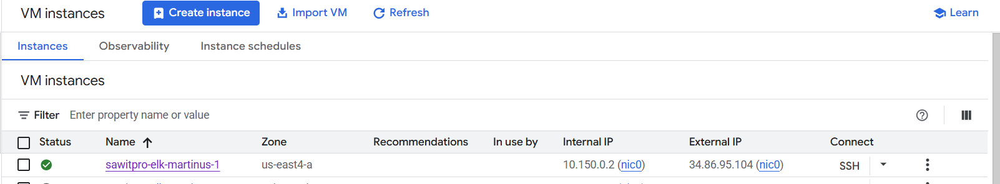
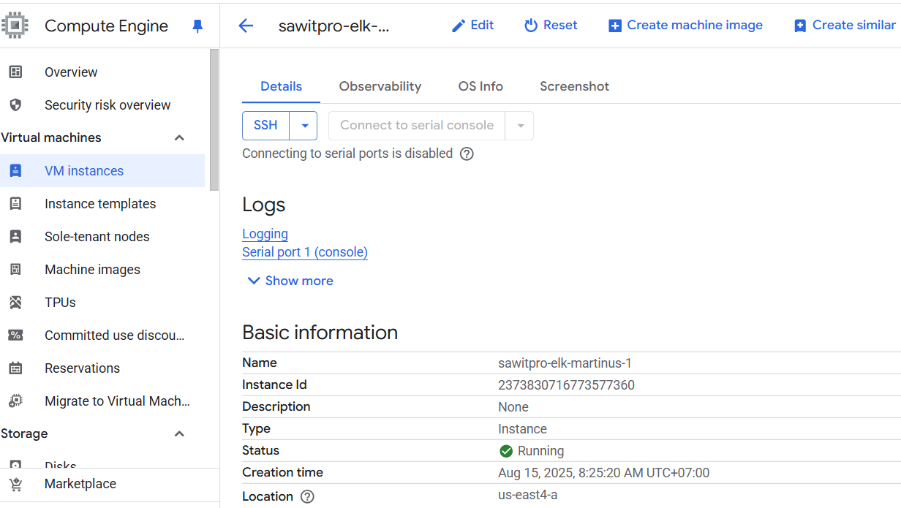
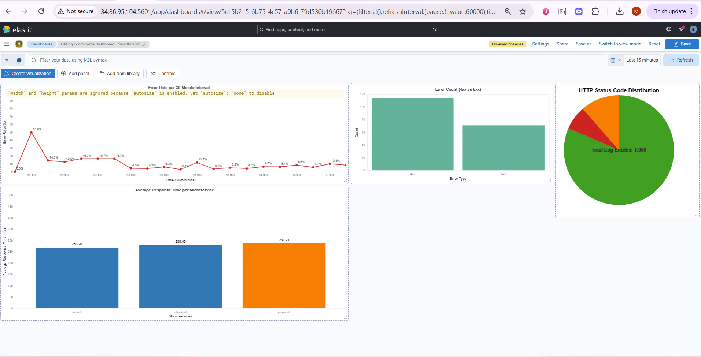

# Log Parsing CLI Tool & ELK for Log Infrastructure

## A. Parser Tool
I create a Golang CLI tool and a Python script for parsing the log. The parser tools located on `log-parser-tools/` folder. 

### A1. Golang CLI
This CLI tool is designed to help Site Reliability Engineers (SREs) parse raw log files, transform them into structured JSON suitable for ingestion into Elasticsearch, and compute useful metrics such as error rates, average response times, and total transactions.

#### Why chose Golang for the CLI tool?
Go is a powerful and simple language, widely used for building CLI tools in the DevOps ecosystem. Popular projects like Docker, Kubernetes, Prometheus, and Terraform rely heavily on Go for their CLI interfaces. While Go has a native flag package for handling command-line arguments, using the Cobra package makes it even easier to create structured, user-friendly CLI applications.

---

#### Features
- Parse logs: Converts raw log files into Elasticsearch Bulk API JSON format.
- Compute metrics: Extracts key metrics (error rate, average response time, transaction count) from logs and outputs them in JSON.

---

#### Prerequisites
Go installed (version 1.20+ recommended)

---

#### Setup

Clone this repository and install dependencies:
```
git clone git@github.com:tampubolon/elk.git
cd log-parser-tool
go mod init sawitpro
go mod tidy
```

---

#### Build
```
go build -o sawitpro main.go
```
This will generate a binary named sawitpro.

---

#### Usage
##### Parse Log 
Converts raw logs into Elasticsearch Bulk API format.
```
./sawitpro parse-log --input sample.log --output-file parsed.json
```
- `--input`: Path to the raw log file.
- `--output-file`: Path to save the structured JSON (default: `parsed.json`).

Example output in `parsed.json`:
```
{ "index": { "_index": "ecommerce-index", "_id": "1" } }
{ "timestamp": "2025-08-15 13:45:00", "microservice": "checkout", "status": 200, "response_time": 120, "user_id": "user1234", "transaction_id": "tx5678", "description": "Purchased iPhone 13" }
```
##### Compute Metrics
Computes useful metrics from the log file and outputs them in JSON.
```
./sawitpro compute-metrics --input sample.log --output-file metrics.json
```

- `--input`: Path to the raw log file.
- `--output-file`: Path to save the metrics JSON (default: metrics.json).

Example output in `metrics.json`:
```
{
  "total_log_entries": 1000,
  "error_count": 185,
  "5xx_count": 71,
  "4xx_count": 114,
  "200_count": 815,
  "error_rate": 0.185,
  "average_response_time": 278.53
}
```

---
</br>

### A2. Python Script
`log-parser-tools/parser.py`, this Python script parses a `.log` file and converts it into a `.json` file formatted for **Elasticsearch bulk ingestion**.

---

#### Features
- Reads a structured log file.
- Parses each line using a regular expression.
- Generates a JSON output compatible with Elasticsearch bulk API.
- Automatically assigns unique `_id` values for each log entry.

---

#### Requirements
- Python 3.x

No external packages are required; the script uses Python's built-in `re` module.

---

#### Usage

1. Place your log file in the same directory as the script (default: `sample.log`).
2. Modify the `input_file` and `output_file` variables if needed:

```python
input_file = "sample.log"
output_file = "parsed_sample.json"
```

---

#### Run the script
`python log_parser.py`

---

#### Log Format
sampe.log format:
```
[timestamp] [microservice] [status] [response_time]ms [user_id] [transaction_id] [description]
```

Example:
```
2025-08-16T12:34:56Z payment 200 150ms user123 txn789 Payment successful
```

Output Format:

The generated JSON file will include Elasticsearch bulk indexing commands:
```
{ "index": { "_index": "ecommerce-index", "_id": "1" } }
{ "timestamp": "2025-08-16T12:34:56Z", "microservice": "payment", "status": 200, "response_time": 150, "user_id": "user123", "transaction_id": "txn789", "description": "Payment successful" }
```

---
</br>

## B. ELK Stack for Logging Infrastructure

### Why ELK stack?
I chose the ELK stack for logging infrastructure because it provides a reliable way to collect and analyze logs from multiple services in one place. I have hands-on experience using Elasticsearch, Logstash, and Kibana, so I’m comfortable setting up log pipelines, creating dashboards, and monitoring system performance. With ELK, it’s easier to troubleshoot issues, spot patterns, and respond quickly when problems arise, which helps keep systems running smoothly.

#### Demo
Below screen recording video is ELK demo, it shows the ingested logs, dashboard, infrastructure monitoring and ELK cluster info:


--- 

#### EKS Cluster Access Credential
You can access the ELK cluster from:
- Cluster: http://34.86.95.104:5601/
- Username: `sawitpro`
- Password: `SawitProTeam2025`

---

#### Step to Setup ELK Infrastructure
This ELK infrastructure runs on top of GCP VM. 
The ELK stack run using Docker container managed by Docker Compose.
Step to setup this ELK infrastructure:
- Provision GCP VM from GCP console
    
    

- Setup correct firewall for the VM to make Kibana accessible from internet.
- Access the VM using SSH.
- Clone this repo into the VM using git CLI.
- Add `.env` into the root folder of this project, the file should look like below:
    ```
    # Password for the 'kibana_system' user (at least 6 characters)
    KIBANA_PASSWORD=changeme

    # Version of Elastic products
    STACK_VERSION=8.18.4

    # Set the cluster name
    CLUSTER_NAME=sawitpro-martinus-elk

    # Set to 'basic' or 'trial' to automatically start the 30-day trial
    LICENSE=basic
    #LICENSE=trial

    # Port to expose Elasticsearch HTTP API to the host
    ES_PORT=9200

    # Port to expose Kibana to the host
    KIBANA_PORT=5601

    # Increase or decrease based on the available host memory (in bytes)
    ES_MEM_LIMIT=1073741824
    KB_MEM_LIMIT=1073741824
    LS_MEM_LIMIT=1073741824

    # SAMPLE Predefined Key only to be used in POC environments
    ENCRYPTION_KEY=c34d38b3a14956121ff2170e5030b471551370178f43e5626eec58b04a30fae2
    ```
    - run `docker-compose` on root folder of this project (where docker compose file located):
    ```
    docker-compose up -d
    ```
- Access Kibana from GCP VM Public IP.
- Setup Elasticsearch `index` for log, upload parsed log, setup `data view`, and `dashboard`. Use [Vega Script](https://vega.github.io/vega/) on `assets/` folder to setup the dashboard.


### Dashboard
ELK Dashboard can be access from [this link](http://34.86.95.104:5601/app/dashboards#/view/5c15b215-6b75-4c57-a0b6-79d530b19667?_g=(filters:!(),refreshInterval:(pause:!f,value:10000),time:(from:now-15m,to:now)))   

There are four panels on the Dashboard:
- Error rate per 30-minutes interval: Percentage of error for every 30 minutes interval.
- Error count for http code 4xx and 5xx.
- HTTP status code distribution.
- Average response time per microservices. 


#### Reference
- https://www.elastic.co/blog/getting-started-with-the-elastic-stack-and-docker-compose